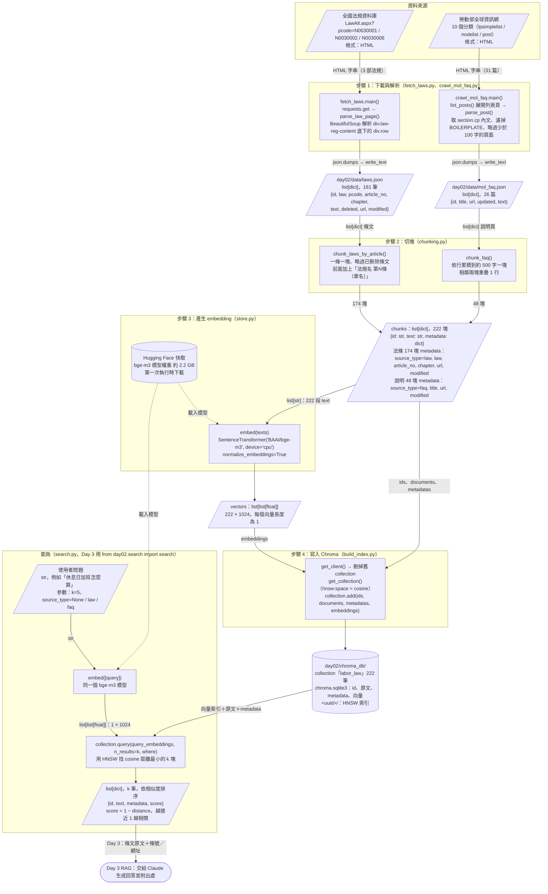

# Day 2 流程圖

方框是程式（函式），斜框是資料，箭頭上標的是傳遞的資料格式。上半部是建索引（只跑一次），下半部是查詢（Day 3 每次提問都會走）。

## 對應的執行指令

| 步驟 | 指令 | 產出 |
|---|---|---|
| 1 | `.\.venv\Scripts\python.exe -m day02.fetch_laws` | `data/laws.json` |
| 1 | `.\.venv\Scripts\python.exe -m day02.crawl_mol_faq` | `data/mol_faq.json` |
| 2–4 | `.\.venv\Scripts\python.exe -m day02.build_index` | `chroma_db/` |
| 查詢 | `.\.venv\Scripts\python.exe -m day02.search "問題"` | 印出前 5 名 |
